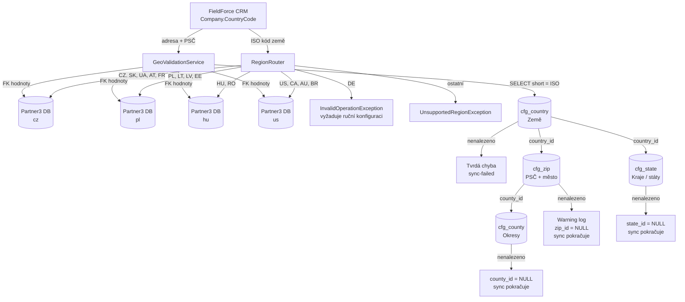

# Geografická struktura FF-Partner Bridge

## Přehled

Systém pracuje se **dvěma nezávislými geografickými vrstvami**:

1. **Routing** — do které Partner3 DB instance firma patří (dle ISO kódu země)
2. **Adresní členění** — hierarchie kraj → okres → PSČ uvnitř každé země (GAIA číselníky)

---

## Vrstva 1 — Routing zemí do Partner3 DB instancí

Pevně zakódováno v `RegionRouter.cs`. Určuje výhradně **organizační/obchodní příslušnost** — ne geografickou blízkost.

| Partner3 DB instance | Země (ISO kódy) |
|---|---|
| `cz` | CZ, SK, UA, AT, FR |
| `pl` | PL, LT, LV, EE |
| `hu` | HU, RO |
| `us` | US, CA, AU, BR |
| _(bez routingu)_ | DE — výjimka, vyžaduje ruční konfiguraci v owner mappingu |
| _(nepodporováno)_ | vše ostatní → `UnsupportedRegionException` |

> **Poznámka:** Routing nesmí být změněn bez explicitního souhlasu (CLAUDE.md sekce 6).

---

## Vrstva 2 — Adresní členění uvnitř zemí (GAIA číselníky)

GAIA je **read-only** referenční databáze. Bridge nikdy nepíše — výhradně čte FK hodnoty pro uložení do Partner3.

### Hierarchie tabulek

| Tabulka | Obsah | Klíčové sloupce |
|---|---|---|
| `cfg_country` | Země | `id`, `short` (ISO kód), `name` |
| `cfg_state` | Kraj / stát / vojvodství | `id`, `name`, `country_id` |
| `cfg_county` | Okres / county / powiat | `id`, `name`, `state_id` |
| `cfg_zip` | PSČ + město | `id`, `zip`, `city`, `country_id`, `county_id`, `state_id` |

### Lookup logika (GeoValidationService)

| Úroveň | Metoda vyhledávání | Chování při nenalezení |
|---|---|---|
| **Země** | Přesná shoda `short = @IsoCode` | **Tvrdá chyba** — sync selže, publikuje `sync-failed` |
| **PSČ** | 1. přesná shoda → 2. normalizace (bez mezer/pomlček) → 3. Levenshtein ≤ 2 na prefix | `zip_id = NULL`, Warning log — sync **neblokuje** |
| **Kraj** | `LIKE '%name%'` filtrovaný na `country_id` | `state_id = NULL` — sync **neblokuje** |
| **Okres** | `LIKE '%name%'` přes `county_id` z PSČ záznamu, fallback bez filtru | `county_id = NULL` — sync **neblokuje** |

### Co se ukládá do Partner3 `tbl_client`

| Sloupec | Zdroj v GAIA | Povinný |
|---|---|---|
| `client_country_id` | `cfg_country.id` | **ANO** — tvrdá chyba pokud chybí |
| `client_country_short` | `cfg_country.short` | **ANO** |
| `client_state_id` | `cfg_state.id` | ne |
| `client_state` | `cfg_state.name` (fallback: vstup z FF) | ne |
| `client_county_id` | `cfg_county.id` | ne |
| `client_county` | `cfg_county.name` (fallback: vstup z FF) | ne |
| `client_zip_id` | `cfg_zip.id` | ne |
| `client_city` | `cfg_zip.city` (fallback: vstup z FF) | ne |
| `client_psc` | vstup z FieldForce | ne |

---

## Schéma

---

## Omezení a poznámky

- **GAIA je read-only** — Bridge nikdy neprovádí `INSERT`/`UPDATE`/`DELETE` do žádné GAIA tabulky.
- **FK hodnoty jsou region-specifické** — `country_id` z jedné GAIA instance nelze zapsat do jiné Partner3 DB. Při přesunu firmy mezi regiony (`MoveClientToRegionSaga`) se geo FK resetují na originální hodnoty původního regionu, pokud saga selže.
- **Obsah GAIA číselníků** (dostupná PSČ, kraje, okresy) Bridge neřídí — závisí na datech spravovaných mimo Bridge.
- **DE** je jediná země s explicitním vyloučením z automatického routingu — naznačuje plánované rozšíření.
